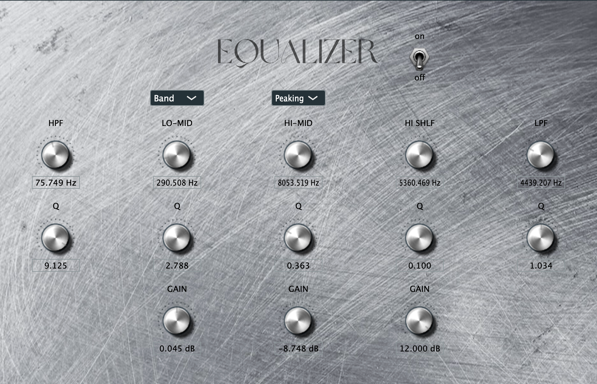

# Biquad Plugin

Equalizer plugin made in MATLAB and exported to a JUCE plugin.

Includes a high shelf, high mid band, low mid band, low pass filter, and high pass filter, along with a compressor.

